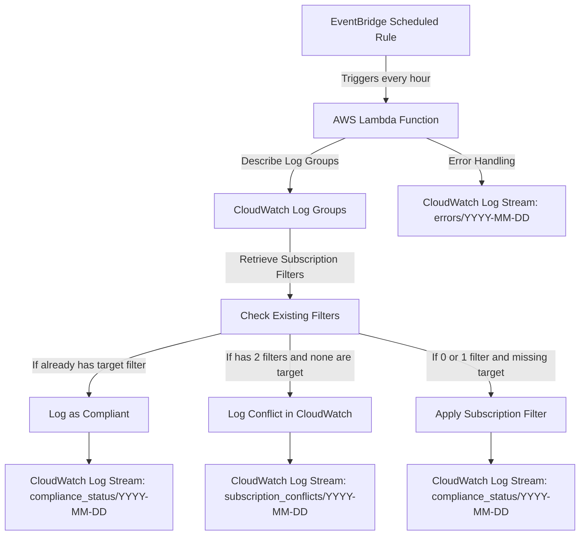

# **CloudWatch Log Group Subscription Filter Manager**

## **Overview**
This project ensures all CloudWatch Log Groups have a required subscription filter applied. The Lambda runs every hour and performs the following checks:

- Lists all CloudWatch log groups.
- Checks the existing **subscription filters** for each log group.
- If a log group has **0 or 1 filters**, it applies the required subscription filter.
- If a log group has **2 existing filters**, it logs a conflict in a designated **CloudWatch Log Group**.
- Logs all compliance status, skipped reasons, and errors in structured log streams.

---

## **Architecture Diagram**


---

## **Lambda Function Details**
### **Functionality**
- **Triggers every hour via EventBridge.**
- **Checks all CloudWatch Log Groups** to determine compliance.
- **Logs results** in CloudWatch for monitoring.

### **Environment Variables**
| Variable | Description |
|----------|-------------|
| `TARGET_SUBSCRIPTION_FILTER` | The name of the subscription filter to apply. |
| `DESTINATION_ARN` | The ARN of the destination (Lambda, Firehose, or another log group). |
| `LOG_GROUP_NAME` | The CloudWatch Log Group used for logging compliance and conflicts. |

### **Compliance and Error Logging**
The Lambda logs status updates to **CloudWatch Log Streams**:
- ✅ **Compliant Log** (`compliance_status/YYYY-MM-DD`):
  ```json
  {
    "log_group": "/aws/lambda/app-logs",
    "status": "Compliant",
    "reason": "Already has target filter",
    "timestamp": "2025-03-07T12:00:00Z"
  }
  ```
- ⏩ **Skipped Log** (`compliance_status/YYYY-MM-DD`):
  ```json
  {
    "log_group": "/aws/lambda/api-logs",
    "status": "Skipped",
    "reason": "Two filters already exist",
    "timestamp": "2025-03-07T12:10:00Z"
  }
  ```
- 🔄 **Updated Log** (`compliance_status/YYYY-MM-DD`):
  ```json
  {
    "log_group": "/aws/lambda/api-logs",
    "status": "Updated",
    "reason": "Subscription filter applied",
    "timestamp": "2025-03-07T12:10:00Z"
  }
  ```
- ❌ **Error Log** (`errors/YYYY-MM-DD`):
  ```json
  {
    "context": "/aws/lambda/broken-log-group",
    "error": "AccessDenied: Not authorized to put subscription filter",
    "timestamp": "2025-03-07T12:15:00Z"
  }
  ```

---

## **Deployment Instructions**
### **1. Package the Lambda Code**
```sh
zip lambda.zip lambda_function.py
```

### **2. Deploy Using Terraform**
```sh
terraform init
terraform apply -auto-approve
```

### **3. Verify Execution**
- Check the logs in **CloudWatch Log Group: `/aws/lambda/cloudwatch-log-monitor`**
- Run the following command to verify subscription filters:
  ```sh
  aws logs describe-subscription-filters --log-group-name "/aws/lambda/my-log-group"
  ```

---

## **Conclusion**
This project automates CloudWatch Log Group compliance by ensuring that every log group has a required **subscription filter**. It provides structured logging for **compliance tracking, conflict detection, and error reporting**, making it easier to monitor and troubleshoot CloudWatch log subscriptions.

